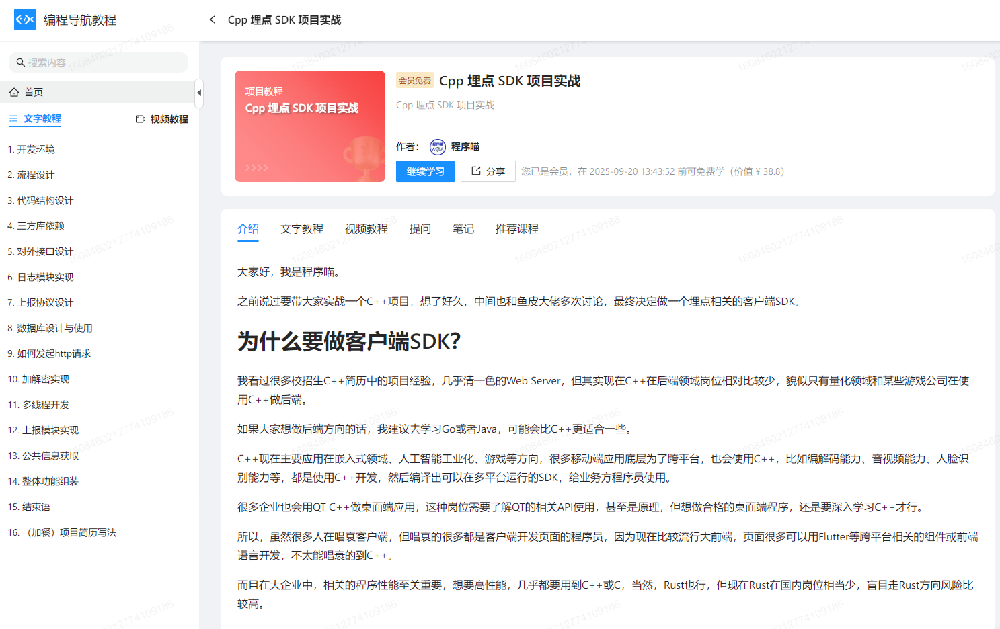

# 项目实战 - 鱼皮原创项目教程系列

> ⭐️ 加入项目系列学习：[加入编程导航](https://yuyuanweb.feishu.cn/wiki/SDtMwjR1DituVpkz5MLc3fZLnzb) 
>
> **所有项目资料均已加密，仅供加入者本人观看。**

鱼皮原创项目系列以 **实战** 为主，用全程直播的方式，从 0 到 1 带大家学习技术知识，并立即实践运用到项目中，做到学以致用。

此外，还提供如下服务：

- 详细的直播笔记
- 完整的项目源码
- 答疑解惑
- 专属项目交流群
- ⭐️ 现成的简历写法（直接写满简历）
- ⭐️ 项目的扩展思路（拉开和其他人的差距）
- ⭐️ 项目相关面试题、题解和真实面经（提前准备，面试不懵逼）
- ⭐️ 前端 + Java 后端万用项目模板（快速创建项目）

比起看网上的教程学习，鱼皮项目系列的优势：

> 从学知识 => 实践项目 => 复习笔记 => 项目答疑 => 简历写法 => 面试题解的一条龙服务

| 对比维度 | 跟学鱼皮项目                                                 | 自学网上免费项目                                             | ⭐️ 鱼皮项目优势               |
| -------- | ------------------------------------------------------------ | ------------------------------------------------------------ | ---------------------------- |
| 项目选题 | ✅ 选题新颖，刻意避开网上热门项目                             | 传统项目场景（博客、商城、管理系统）                         | 增加区分度，提高简历通过率   |
| 学习人数 | ✅ 少，不容易撞车                                             | 百万以上，烂大街                                             | 增加区分度，提高简历通过率   |
| 教学方式 | ✅ 全程直播，带你敲每一行代码、带你踩坑和解决 Bug，不漏过每一个细节 | 录制课程，视频虽然看起来简短、一帆风顺，但你遇到错误无从下手 | 降低学习门槛，减少学习时长   |
| 直播笔记 | ✅ 详细的官方笔记 + 精选学员优质笔记                          | 有笔记，但未经筛选                                           | 学到更多知识细节             |
| 视频内容 | ✅ 项目教程 + 经验分享                                        | 项目教程                                                     | 学到更多编程经验             |
| 项目源码 | ✅ 完整源码仓库 + 每章的提交记录 + 定期更新                   | 只有代码包、不更新                                           | 节省时间，避免踩坑           |
| 项目答疑 | ✅ 各项目交流群 + 答疑解惑 + 常见问题整理                     | 无免费的答疑服务，遇到问题自行解决                           | 节省时间                     |
| 简历写法 | ✅ 现成的简历写法                                             | 无                                                           | 节省时间、提高简历通过率     |
| 项目扩展 | ✅ 给出扩展思路 + 学员作品共享                                | 无                                                           | 开拓思路、拉开和其他人的差距 |
| 项目面试 | ✅ 项目相关面试题、题解和真实面经                             | 无                                                           | 提前准备，面试不懵逼         |

编程导航已有 **10 多套项目教程！**每个项目的学习重点不同，几乎全都是前端 + 后端的 **全栈****项目** 。

> 所有 [加入编程导航](https://yuyuanweb.feishu.cn/wiki/SDtMwjR1DituVpkz5MLc3fZLnzb) 的同学可获鱼皮授权将项目作为毕业设计，并获取毕设建议。
>
> 按照 [鱼皮项目学习建议](https://yuyuanweb.feishu.cn/wiki/Q4AdwjLDWiLZy0kAjHqcQinon8N)，认真完成并理解 4 个及以上的项目，做项目能力可达中厂水平。

## 🔥 鱼皮原创项目系列
### 面试刷题平台（24 年最新）

真实企业级项目，学习实战 React + Next.js 服务端渲染网站开发，后端 Redis 多级缓存、Elasticsearch 搜索、Redisson 高级数据结构、Druid 并发、HotKey 探测、Sa-Token 权限控制、Nacos 动态配置、Sentinel 流控、反爬虫设计等，提升技术运用能力。

> 开始学习或了解详情：[面试鸭刷题平台](https://www.codefather.cn/course/1826803928691945473)
>
> 开源地址：[https://github.com/liyupi/mianshiya-next](https://github.com/liyupi/mianshiya-next)
> 
> 教程试看一集：[https://www.bilibili.com/video/BV1WoWUeaEbn](https://www.bilibili.com/video/BV1WoWUeaEbn)

### AI 答题应用平台（24 年最新）

深入业务场景，学习实战 React 跨端小程序开发、Vue3 AI 应用网站开发，后端分库分表、分布式锁、缓存、幂等设计、设计模式、RxJava 响应式编程、SSE 实时推送、线程池隔离等，大幅提升开发经验和架构设计能力，助你成为项目负责人。

> 开始学习或了解详情：[AI 答题应用平台](https://www.codefather.cn/post/1797906199350734850)
> 
> 教程试看一集：[https://www.bilibili.com/video/BV1m142197hg](https://www.bilibili.com/video/BV1m142197hg)

### 手写 RPC 框架（24 年最新）

基于 Java + Etcd + Vert.x 的高性能 RPC 框架，用新颖的技术栈从 0 到 1 带大家开发轮子。教程由浅入深，可以学习并实践基于 Vert.x 的网络服务器、序列化器、基于 Etcd 和 ZooKeeper 的注册中心、反射、动态代理、自定义网络协议、多种设计模式（单例 / 工厂 / 装饰者等）、负载均衡器设计、重试和容错机制、Spring Boot Starter 注解驱动开发等，大幅提升架构设计能力。

项目分为基础版和扩展版：

- 基础版只需学几个小时，就能写在简历上的小项目~
- 扩展版将是充满亮点的技术类项目，搭配一个业务项目，让简历更有竞争力。

> 开始学习或了解详情：[手写 RPC 框架（24 年最新）](https://yuyuanweb.feishu.cn/wiki/EweIwSYsXiEvCDkzS8BcTiAonyc)
>
> 开源地址：[https://github.com/liyupi/yu-rpc](https://github.com/liyupi/yu-rpc)

### 代码生成器共享平台（24 年最新）

基于 React + Spring Boot + Picocli + 对象存储的 **代码生成器共享平台**，又分为 3 个循序渐进的子项目：基于命令行的本地代码生成器 + 代码生成器制作工具 + 在线代码生成器平台。实践 Java 命令行应用开发、FreeMarker 模板引擎、多种设计模式、对象存储、十几种优化方法、复杂业务的拆解和系统设计、分布式任务调度系统、Vert.x 响应式编程等。

> 开始学习或了解详情：[代码生成器共享平台（24 年最新完结） ](https://yuyuanweb.feishu.cn/wiki/JKRZwxx1AixaPnkzSypcLcqOnic) 
>
> 在线体验：[http://yuzi.code-nav.cn](http://yuzi.code-nav.cn/)
>
> 视频演示：[https://www.bilibili.com/video/BV1EA4m1L7tm/](https://www.bilibili.com/video/BV1EA4m1L7tm/)
>
> 教程试看一集：[https://www.bilibili.com/video/BV1ie411Q7AV](https://www.bilibili.com/video/BV1ie411Q7AV)

### OJ 判题系统

基于 Vue 3 + Spring Boot + Spring Cloud 微服务 + Docker 的编程题目在线评测系统。系统学习并实践前后端模板开发 + 多种设计模式 + 单体项目微服务改造 + Linux 虚拟机远程开发 + Docker 代码沙箱 + Java 安全控制。

> 开始学习或了解详情：[OJ 判题系统（最新完结）](https://yuyuanweb.feishu.cn/wiki/LhjxwgFjwiovTVk9w2vcJoj4nid) 
>
> 试看一集：[https://www.bilibili.com/video/BV1k841127EK](https://www.bilibili.com/video/BV1k841127EK)

### 智能 BI 项目

基于 React + Spring Boot + AIGC 的智能数据分析平台。系统学习并实践异步化 + 线程池 + RabbitMQ 消息队列 + AI 应用开发 + AIGC Prompt 优化。

> 开始学习或了解详情：[智能 BI 平台](https://yuyuanweb.feishu.cn/wiki/GOyNwwip0iwGBck7NtxcpxPlnRf) 
>
> 试看一集：[https://www.bilibili.com/video/BV1Cg4y1G7oy](https://www.bilibili.com/video/BV1Cg4y1G7oy)

### API 开放平台

基于 React + Spring Boot + Dubbo 的分布式项目。系统学习并实践前后端模板开发 + 架构设计 + SDK 开发 + API 签名认证 + Dubbo RPC + Gateway 微服务网关。

> 开始学习或了解详情：[API 开放平台](https://yuyuanweb.feishu.cn/wiki/T4XgwM2Ynib71TkeGS5cXA0pn4e) 
>
> 试看一集：[https://www.bilibili.com/video/BV1Nd4y157Dm](https://www.bilibili.com/video/BV1Nd4y157Dm)

### 聚合搜索平台

基于 Vue 3 + Spring Boot + ES 的搜索中台项目。系统学习并实践爬虫 + Elastic Stack + 设计模式 + 数据同步 + JMeter 压力测试。

> 开始学习或了解详情：[聚合搜索平台](https://yuyuanweb.feishu.cn/wiki/RigVw1gAdiXIfLkj6ktclEDQn7e) 
>
> 试看一集：[https://www.bilibili.com/video/BV1ks4y1V7jC/](https://www.bilibili.com/video/BV1ks4y1V7jC/)

### 用户中心系统

基于 React + Spring Boot 的 PC 网站。适合学完框架的新手入门，系统学习完整的项目开发流程和上线方法。

> 开始学习或了解详情：[用户中心项目](https://yuyuanweb.feishu.cn/wiki/DclswHMhkiRXckkWve1ckXTonDh) 
>
> 试看一集：[https://www.bilibili.com/video/BV1ze4y1471b](https://www.bilibili.com/video/BV1ze4y1471b)

### 伙伴匹配系统

基于 Vue 3 + Spring Boot + Redis 的移动端 APP。帮助巩固开发流程，学习 Redis、事务、并发编程、大数据推荐思想等后端知识。

> 开始学习或了解详情：[伙伴匹配系统](https://yuyuanweb.feishu.cn/wiki/UHbLwJ5l7i6GJkkKI4Oc26Y6n1g) 
>
> 试看一集：[https://www.bilibili.com/video/BV1hP411P7Eg](https://www.bilibili.com/video/BV1hP411P7Eg)

## 🔧 万用项目模板

> ⭐️ 加入项目系列学习：[加入编程导航](https://yuyuanweb.feishu.cn/wiki/SDtMwjR1DituVpkz5MLc3fZLnzb) 

### Java 后端万用项目模板

基于 Java SpringBoot 的项目初始模板，整合了常用框架和主流业务的示例代码。

只需 **1 分钟** 即可完成内容网站的后端！！！大家还可以在此基础上快速开发自己的项目。

详情请见：[Java 后端万用项目模板](https://yuyuanweb.feishu.cn/wiki/Nnu3wSBrri3umyk1StnctK0LnAd) 

### 前端万用项目模板

基于 React + Ant Design 的项目初始模板，整合了常用框架和主流业务的示例代码。

只需 **1 分钟** 即可完成网站的基础前端！！！大家还可以在此基础上快速开发自己的项目。

详情请见：[前端万用项目模板](https://yuyuanweb.feishu.cn/wiki/BurMwWufJiSpfrkRSvnc9eHmnFb) 

## ⛺️ 项目训练营

[项目训练营（寻爱网项目）](https://www.codefather.cn/course/1806250609774997505)：学习从立项到上线的完整做项目流程 + 优化思路

> 免费试看：[点击在线观看](https://www.aliyundrive.com/s/rcFczasMKVK)，提取码: cu89

## 📚 编程导航专属项目教程

> 编程导航内部共创的项目实战教程，很适合练手或者作为毕业设计项目。

### 企业周边展示管理系统

基于 Spring Boot + React + Ant Design 组件库 + MySQL + Redis 的 **企业级周边系统**，直观清晰地展示公司周边奖品、并且提高公司内部的周边申请和管理效率。

> 开始学习或了解详情：[https://github.com/yuyuanweb/peripheral-backend](https://github.com/liyupi)
>
> 在线体验：[https://prize.yuyuanweb.com/](https://github.com/liyupi)

### 动态公告系统

基于 Spring Boot + MySQL + React + Ant Design 组件库 + SweetAlert 的动态公告系统，包括后台公告管理和前端 SDK 开发，只需一行代码即可给项目增加灵活的公告弹窗展示能力，高效通知触达用户。

> 开始学习或了解详情：[https://www.codefather.cn/course/1789199181551738882](https://github.com/liyupi)

### 埋点 SDK 项目实战（C++）

客户端埋点 SDK 项目，可以监控应用的状态，比如日活、是否有崩溃、崩溃率、模块异常情况、用户行为等。

项目包含了很多大型项目涉及到的技术点，比如线程池、定时器、Windows 注册表、数据库、文件系统、日志系统、网络通信协议设计、加解密、C++ 新特性等。对于学习进阶 C++、提升项目经验会很有帮助。

> 开始学习或了解详情：[https://www.codefather.cn/course/1793909668081098753](https://github.com/liyupi) （可在编程导航专栏内阅读）

## ⚔ 真实业务场景教程

> 主打小而精的企业真实业务实战教程，快速给简历增加亮点

1. [简历中英文翻译实战教程](https://www.codefather.cn/course/1789200352035184641/section/1789200491340603393?type=)
2. [单设备登录限制实战教程](https://www.codefather.cn/course/1789200352035184641/section/1789200584584175618?type=)
3. [短信群发实战教程](https://www.codefather.cn/course/1789200352035184641/section/1789200454422339586?type=)

持续更新中。。。

## 📺 独家项目经验分享

> ⭐️ 加入项目系列学习：[加入编程导航](https://yuyuanweb.feishu.cn/wiki/SDtMwjR1DituVpkz5MLc3fZLnzb) 

### 鱼皮原创开源项目经验分享

1. [Web 终端项目经验分享](https://www.codefather.cn/course/1789200994552225793/section/1789202150334636034?type=)：前后端技术选型 + 系统设计 + 源码解读 + 简历亮点全面分享
2. [面试刷题网站项目经验分享](https://www.code-nav.cn/live/1808332430976552962)：从 0 到 1 分享数万用户网站的创作过程和经验分享
3. [编程导航兑奖系统开发](https://www.codefather.cn/live/1808037918957965313)：编程导航网站真实开发过程大揭秘
4. [SQL 代码数据生成项目分享](https://www.codefather.cn/course/1789200994552225793/section/1789202105212313601?type=)：系统设计 + 源码解读 + 简历亮点全面分享
5. [SQL 闯关式自学网站项目](https://www.codefather.cn/course/1789200994552225793/section/1789201878677954561)：纯前端 Vue3 + 代码编辑器项目，适合参与开源贡献
6. [分布式邮件调度平台](https://www.codefather.cn/course/1789200994552225793/section/1789202193154285569?type=#)：Vue + Spring Boot + Redis + InfluxDB 的分布式项目，含设计说明书、竞赛展示 PPT

### 项目导学

1. [苍穹外卖 - 外卖点餐小程序](https://www.codefather.cn/course/1789200994552225793/section/1789202943246835714?type=)：Java Spring Boot 入门级项目，业务流程完整、功能丰富、技术多样、适合刚学完框架的同学（相比于下面的瑞吉外卖，知识更多）
2. [瑞吉外卖 - 外卖点餐系统](https://www.codefather.cn/course/1789200994552225793/section/1789203156070014977?type=)：Java Spring Boot 入门级项目，适合刚学完框架的同学
3. [尚医通 - 在线预约挂号平台](https://www.codefather.cn/course/1789200994552225793/section/1789203362291359746?type=)：业务功能完整的 Java Spring Cloud 微服务项目，适合刚学完微服务的同学
4. [硅谷课堂 - 在线学习平台](https://www.codefather.cn/course/1789200994552225793/section/1789203428884324354?type=)：业务功能完整的 Java Spring Cloud 微服务项目，适合想学习第三方服务对接的同学
5. [黑马点评 - 类似大众点评的移动 APP](https://www.codefather.cn/course/1789200994552225793/section/1789203495292739586?type=)：专门为学习 Redis 定制的单体项目，适合刚学完 Spring Boot、想系统学习 Redis 的同学

## 鱼皮免费开源项目

鱼皮 GitHub：[https://github.com/liyupi](https://github.com/liyupi) （国内：[[https://gitee.com/liyupi](https://gitee.com/liyupi)]）

SQL 闯关式自学网（纯前端项目）：[https://github.com/liyupi/sql-mother](https://github.com/liyupi/sql-mother)

极客范儿浏览器主页（重前端项目）：[https://github.com/liyupi/yuindex](https://github.com/liyupi/yuindex)

SQL 数据生成器（React + Java）：[https://github.com/liyupi/sql-father-frontend-public](https://github.com/liyupi/sql-father-frontend-public)

免费网络安全自学网（纯前端项目）：[https://github.com/liyupi/ceshiya](https://github.com/liyupi/ceshiya)

结构化 SQL 语句生成器：[https://github.com/liyupi/sql-generator](https://github.com/liyupi/sql-generator)

面试刷题网（React + Node）：[https://github.com/liyupi/mianshiya-public](https://github.com/liyupi/mianshiya-public)

编程资源网（React + 云开发）：[https://github.com/liyupi/code-nav](https://github.com/liyupi/code-nav)

AI 自动回复工具（Java 项目）：[https://github.com/liyupi/yu-auto-reply](https://github.com/liyupi/yu-auto-reply)

鱼了个鱼（纯前端项目）：[https://github.com/liyupi/yulegeyu](https://github.com/liyupi/yulegeyu)

表情包网站（Vue + Java）：[https://github.com/liyupi/father](https://github.com/liyupi/father)

静态文档网站：[https://github.com/liyupi/code-xingqiu](https://github.com/liyupi/code-xingqiu)

Ikun 测试器（Vue）：[https://github.com/liyupi/ikun-test](https://github.com/liyupi/ikun-test)

名称生成器（Vue）：[https://github.com/liyupi/good-name](https://github.com/liyupi/good-name)

## 更多项目推荐

更多项目推荐可以在 [原创编程学习路线](https://www.codefather.cn/course/1789189862986850306) 和 [编程导航原创编程学习知识库](https://www.codefather.cn/course/1782335162700775426) 中查看。

## 加入学习

微信扫码加入编程导航，开启您的编程项目学习之旅~

> 更多关于编程导航的信息，请阅读：[💎 编程学习 - 编程导航](https://yuyuanweb.feishu.cn/wiki/VC1qwmX9diCBK3kidyec74vFnde) 

